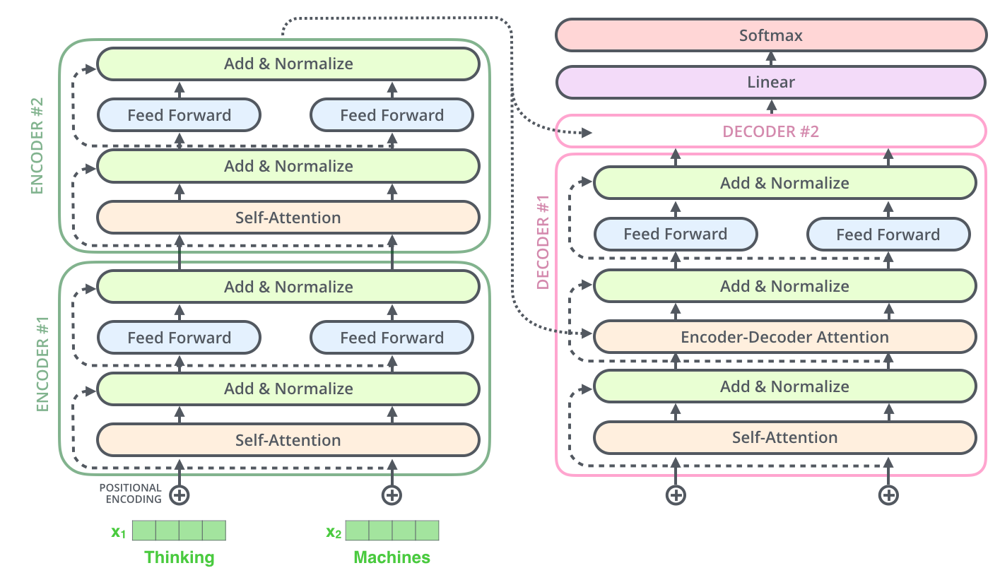

This blog delves into how transformers and self-attention are pushing the boundaries of NLP and shaping the AI landscape.

## 1. Introduction

### Are humans moving into the AI era?

AI is becoming increasingly prevalent daily, which led many to debate whether humans are moving into the AI era. We are already in the AI era; from chatbots and virtual assistants to self-driving cars and predictive analytics, AI transforms how we live and work.

  

While many may view this as a threat to human jobs and autonomy, others see it as an opportunity for innovation and progress. As we move further into the AI era, it is important to understand the potential benefits and challenges of this technology and to work towards building a strong foundation of AI literacy and education

## The Rising Popularity of AI

  

While ChatGPT is a language model that has risen in popularity and contributed to the development and improvement of AI, it would not be accurate to say that it is a major influencer of the rising popularity of AI. The factors such as the availability of big data, improved computing power, and breakthroughs in AI research, have been the main drivers of the recent growth in AI. However, we can say that language models like ChatGPT have played an important role in advancing the field of natural language processing (NLP), which is a key area of AI research. ChatGPT and other NLP models have demonstrated impressive capabilities in generating human-like text and understanding language, which has opened up new possibilities for applications like chatbots, virtual assistants, and content generation. As AI continues to advance, NLP models like ChatGPT will play an increasingly important role in shaping the future of AI and its applications.

## 2. Language Models

Before I explain further, transformer architecture and how effective it is, I want to give you some background on how language models have evolved. By understanding this history anyone can fully appreciate the importance and impact of the innovative architecture of the transformers.

### Evolution of Language Models

Language is the primary means of communication between humans, and as a result, developing models that can understand and generate language has been a longstanding goal in the field of AI. Over the years, significant progress has been made in this domain, with language models evolving from simple statistical models to sophisticated transformer-based architectures that can generate coherent and contextually relevant text. In this context, exploring the evolution of language models provides a valuable perspective on the advances made in NLP and the challenges that remain in developing intelligent machines that can effectively comprehend and communicate in human language.

### Statistical Models 
The first stage, statistical models, emerged in the late 1950s and 1960s and relied on counting the frequency of words and sequences of words in a corpus of text to make predictions and also to model the probabilities of word sequences, with applications in speech recognition and machine translation. These models included techniques such as n-gram models and Hidden Markov Models.

### Neural-Network based Models

In the 2000s and 2010s, neural network-based models such as Recurrent Neural Networks (RNNs) and Long Short-Term Memory (LSTM) networks gained prominence. 

  
  
   An unrolled recurrent neural network(RNN). 

These models use deep learning techniques to learn complex patterns and relationships within language. These models were able to capture long-term dependencies in text and achieve state-of-the-art results in tasks such as language modelling and machine translation.

  
  
   Long Short Term Memory(LSTM) with its gates 

### Transformer based Models

In 2017, the Transformer model was introduced, which revolutionized the field of natural language processing. Unlike RNNs and LSTMs, which process text sequentially, the Transformer model is based on a self-attention mechanism that enables it to capture global dependencies in the text more efficiently. This allowed for faster training and better performance on a variety of language-processing tasks.

## 3. Transformers and Self Attention

Before we talk about the Transformer architecture in detail, I want to mention some problems with LSTMs and how the Transformer architecture solves those problems.

### Limitations of LSTMs

Although LSTMs have been successful in many natural language processing tasks, they have some limitations that led to the development of the transformer architecture.

- ***LSTMs are inherently sequential models that process text one word at a time*** - making them computationally expensive and slow. This limits their ability to process long sequences of text efficiently.
- ***LSTMs are susceptible to the vanishing gradient problem*** - which occurs when gradients become very small as they propagate through the network, leading to slow convergence and degraded performance.
- ***LSTMs are limited in their ability to model global dependencies in text*** - This is because they process text sequentially, they may not be able to capture long-range dependencies between words that are separated by many words in a sentence.

  
  
   Vanishing Gradient:  where the contribution from the earlier steps becomes insignificant in the gradient for an RNN 

### Transformer Architecture and its components

The Transformer architecture was designed and proposed in the paper “***Attention Is All You Need***” to address the limitations of LSTMs. By using the self-attention technique, the Transformer can process text in parallel and capture global dependencies more efficiently. Additionally, the Transformer uses residual connections and layer normalization to combat the vanishing gradient problem, resulting in faster training and improved performance.

A two-layer encoder-decoder Transformer architecture

  
  
   A two-layer encoder-decoder Transformer architecture 

### A High-Level Look on Major Components of Transformers

To begin, consider the transformer as a single entity. When used for language translation, we input a sentence in one language and receive the translated sentence in another language as output. The assumed single entity contains an encoding component, a decoding component, and connections that link the two.

  
  
   A two-layer encoder-decoder Transformer architecture 

## Encoding

The encoding part is made up of several encoders stacked on top of each other. The decoding part is also made up of the same number of decoders

  

The encoders are all identical in structure. Each one is broken down into two sub-layers:

  

First, the encoder processes the input through a self-attention layer, which allows it to consider other words in the sentence as it encodes each word. Then, the output goes through a feed-forward neural network. The same network is used for every word in the sentence.

The decoder also has these two layers, but with an attention layer in between. This helps the decoder pay attention to important parts of the input sentence, like in sequence-to-sequence models.

  

As previously stated, an encoder accepts a list of vectors as input, which it analyzes by first feeding them into a 'self-attention' layer. The resulting output is then forwarded to a feed-forward neural network, with the ultimate output transmitted to the subsequent encoder.

  
  
   The word at each position passes through a self-attention process. Then, they each pass through a feed-forward neural network -- the same network with each vector flowing through it separately. 

### The Self-attention mechanism

In layman’s terms, the self-attention mechanism allows the inputs to interact with each other (“self”) and find out to who they should pay more attention (“attention”). 

For example, consider a sentence we want to translate:

”`The animal didn't cross the street because it was too tired`”

Determining whether the word "it" refers to the street or the animal may seem like a simple question for a human, but it's not an easy task for an algorithm. The model employs self-attention to associate "it" with "animal". This technique enables the model to evaluate other words in the input sequence, consequently enhancing the encoding of the present word.

For those familiar with RNNs, self-attention can be likened to how a hidden state incorporates preceding words with the present one. Self-attention is the approach utilized by the Transformer model to integrate the meaning of other significant words into the one it's currently processing.

  
  
   When the model was encoding the word "it" in the fifth encoder, the attention mechanism focused on "The Animal" and included some of its meaning in the encoding of "it". 

### Maintaining the sequence of words using positional encoding

Although we've introduced the Transformer architecture, we've yet to account for the sequence of words in the input. To overcome this limitation, the transformer appends a vector to each input embedding. These vectors comply with a pattern that the model acquires during its training, aiding its comprehension of the location of each word and the distance between them. This technique is intended to generate meaningful distances between the vectors once they're converted into Q/K/V vectors and used in dot-product attention.

  
  
   To give the model a sense of the order of the words, we add positional encoding vectors -- the values of which follow a specific pattern. 

### Decoding

Having covered most of the encoder concepts, let's now take a look at how the decoder component works. Initially, the encoder processes the input sequence, and subsequently, the output of the top encoder is converted into attention vectors K and V. These vectors are employed by each decoder in its "encoder-decoder attention" layer, allowing it to concentrate on the pertinent sections of the input sequence.

  
  
  Once the encoding phase is done, we move on to the decoding phase. At each step of the decoding phase, we produce an element of the output sequence (in this case, the translated English sentence). 

## 4. Comparison of SOTA transformer-based models

In recent years, natural language processing (NLP) has made significant progress because of the development of transformer-based models. These models have their own design, training, and objectives, which can affect how well they work for different tasks. Some of the state-of-the-art (SOTA) transformer-based models in NLP include GPT-3, LLaMA, BERT and much more.

GPT-3, LLaMA and BERT are three popular language models that use different architectures to process natural language. Here are some of the main differences:

- GPT-3 is an autoregressive model, which means it only predicts the next word based on the previous words. It uses a decoder-only architecture that consists of stacked transformer blocks.
- LLaMA is a latent language model adaptation model, which means it adapts a pre-trained language model to new domains or tasks. It uses a hybrid architecture that combines an encoder-decoder transformer with a latent variable model.
- BERT is a bidirectional model, which means it predicts a word based on both the left and right context. It uses an encoder-only architecture that consists of stacked transformer blocks.

Each architecture has different strengths and weaknesses for different natural language processing tasks. For example, GPT-3 performs better on generative tasks like text summarization or content creation, while BERT performs better on understanding tasks like question answering or sentiment analysis. LLaMA can improve the performance of both GPT-3 and BERT by adapting them to new domains or tasks with limited data.

Here is tabular information on GPT-3, LLaMA and BERT on some key aspects:

| Aspect | GPT-3 | LLaMA | BERT |
| --- | --- | --- | --- |
| Architecture | Autoregressive decoder-only transformer | Hybrid encoder-decoder transformer with latent variable model | Bidirectional encoder-only transformer |
| Training data | 45 TB of text from Common Crawl and other sources | Pre-trained on 1.4T tokens of text from Wikipedia and BookCorpus then adapted to new domains or tasks with limited data | Pre-trained on 3.3B tokens of text from Wikipedia and BookCorpus  then fine-tuned on specific tasks with labelled data |
| Parameters | 175B | 7B, 13B, 33B, 65B | 340M |
| Access mode | Paid API via OpenAI | Open source via GitHub | Open source via GitHub |
| Strengths | High-quality text generation for various purposes; good performance on zero-shot or few-shot learning; adaptable to new domains or tasks with LLaMA | Improves the performance of pre-trained language models on new domains or tasks with limited data; reduces the need for task-specific fine-tuning; works well with both GPT-3 and BERT | High-quality text understanding for various purposes; good performance on downstream tasks like question answering or sentiment analysis; adaptable to new domains or tasks with LLaMA |
| Weaknesses | Requires a lot of compute power and infrastructure to deploy and use; may generate inaccurate or biased content; may not perform well on understanding tasks like question answering or sentiment analysis  | Requires a pre-trained language model as a base; may not capture all the nuances of natural language; may not perform well on generative tasks like text summarization or content creation | Require labelled data for fine-tuning on specific tasks; may not perform well on generative tasks like text summarization or content creation; may not perform well on zero-shot or few-shot learning  |

These are some of the benchmarks set by each of the SOTA models.

| **Model** | **Benchmark/Dataset** | **Task** | **Result** |
| --- | --- | --- | --- |
| GPT-3 | SuperGLUE | Language understanding | Outperformed humans |
| GPT-3 | GLUE | Text classification, sentiment analysis, question answering | State-of-the-art performance |
| GPT-3 | Language generation | Language translation, summarization, dialogue generation | Impressive performance |
| LLaMA | Winograd Schema Challenge | Reasoning and disambiguation | State-of-the-art performance |
| LLaMA | LAMBADA | Language modelling | Outperformed previous models |
| LLaMA | Natural Language Inference | NLI | Strong performance |
| BERT | GLUE | Text classification, sentiment analysis, question answering | State-of-the-art performance |
| BERT | SuperGLUE | Language understanding | State-of-the-art performance |
| BERT | SQuAD | Question answering | State-of-the-art performance |
| BERT | Named Entity Recognition | Entity recognition and classification | Outperformed previous models |
| BERT | Sentiment Analysis | Sentiment classification | Strong performance |

## 5. Review of language model based AI tools

Language model AI tools are computer programs that use AI and statistics to work with language and make text that sounds like it was written by a human. I've been using some of these tools lately to write blogs and create text for making SOP's.  Here is the comparison of some tools.

AI content creation tools:

| **Feature** | **Jasper.ai** | **Articolo** | **Rytr** | **Kickresume** | **ContentBot.ai** |
| --- | --- | --- | --- | --- | --- |
| Description | An AI copywriting tool that helps you create content faster and easier. It’s AI-powered writing assistant will help you improve the quality of your writing while also saving you time. | An AI content creation platform that helps you generate high-quality articles for your blog, website, or social media. It uses natural language generation to produce original and engaging content based on your keywords or topics. | Rytr is an AI-powered writing assistant platform that can be used for a variety of writing tasks, including content creation for blogs, social media posts, product descriptions, and more | Kickresume is an online resume builder that use AI and ML algorithms to help job seekers create professional-quality resume. | An AI content generator that helps you write better content for your business or personal needs. It uses advanced natural language processing to create unique and relevant content based on your inputs. |
| Main Function | AI Writing Assistant | AI Content Creation Platform | AI Writing Assistant | AI Resume Builder | AI Writing Assistant |
| AI Engine | OpenAI GPT-3 | Custom-built proprietary engine | OpenAI GPT-3 | Custom-built proprietary engine | OpenAI GPT-3 |
| Main Industry Focus | Marketing & Advertising | Marketing & Advertising | General Purpose | Job Search & Recruitment | Marketing & Advertising |
| Writing Capabilities | Copywriting, Social Media Content Creation, Advertising Copy, Landing Pages | Blog Post Writing, Social Media Content Creation, Email Marketing Content | Content Generation, Blog Post Writing, Social Media Content Creation | Resume Writing, Cover Letter Writing, LinkedIn Profile Writing | Blog Post Writing, Social Media Content Creation, SEO Content |
| User Interface | Web and mobile app | Web-based platform | Web-based platform | Web-based platform | Web-based platform |
| Integration | Integrates with popular project management tools | Integrates with popular CMS and email marketing platforms | Integrates with popular CMS and social media platforms | Integrates with popular ATS and job search platforms | Integrates with popular CMS and social media platforms |

## 6. Conclusion

In conclusion, the development of transformers and self-attention mechanisms has had a profound impact on natural language processing and deep learning. These technologies have helped to address long-standing issues with sequence modeling and have paved the way for new advances in fields such as machine translation, summarization, and question answering. The ability of transformers to capture long-range dependencies and understand the meaning of a word in the context of an entire sentence has revolutionized the way we approach natural language processing tasks. As the field continues to evolve, we can expect further breakthroughs in the development of advanced language models and AI tools surrounding it that can generate even more human-like responses and improve the accuracy and efficiency of AI-driven language processing. 

## 7. References
[1. The Illustrated Transformer](https://jalammar.github.io/illustrated-transformer/)

[2. Long Short-Term Memory (LSTM)](https://medium.com/@kangeugine/long-short-term-memory-lstm-concept-cb3283934359)

[3. DALL.E2 for image generation](https://openai.com/index/dall-e-2/)

